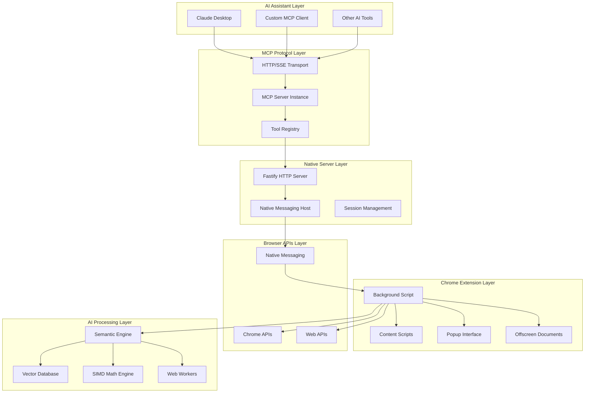

# Chrome MCP Server Architecture 🏗️

This document provides a detailed technical overview of the Chrome MCP Server architecture, design decisions, and implementation details.

## 📋 Table of Contents

- [Overview](#overview)
- [System Architecture](#system-architecture)
- [Component Details](#component-details)
- [Data Flow](#data-flow)
- [AI Integration](#ai-integration)
- [Performance Optimizations](#performance-optimizations)
- [Security Considerations](#security-considerations)

## 🎯 Overview

Chrome MCP Server is a sophisticated browser automation platform that bridges AI assistants with Chrome browser capabilities through the Model Context Protocol (MCP). The architecture is designed for:

- **High Performance**: SIMD-optimized AI operations and efficient native messaging
- **Extensibility**: Modular tool system for easy feature additions
- **Reliability**: Robust error handling and graceful degradation
- **Security**: Sandboxed execution and permission-based access control

## 🏗️ System Architecture



## 🔧 Component Details

### 1. Native Server (`app/native-server/`)

**Purpose**: MCP protocol implementation and native messaging bridge

**Key Components**:

- **Fastify HTTP Server**: Handles MCP protocol over HTTP/SSE
- **Native Messaging Host**: Communicates with Chrome extension
- **Session Management**: Manages multiple MCP client sessions
- **Tool Registry**: Routes tool calls to Chrome extension

**Technologies**:

- TypeScript + Fastify
- MCP SDK (@modelcontextprotocol/sdk)
- Native messaging protocol

### 2. Chrome Extension (`app/chrome-extension/`)

**Purpose**: Browser automation and AI-powered content analysis

**Key Components**:

- **Background Script**: Main orchestrator and tool executor
- **Content Scripts**: Page interaction and content extraction
- **Popup Interface**: User configuration and status display
- **Offscreen Documents**: AI model processing in isolated context

**Technologies**:

- WXT Framework + Vue 3
- Chrome Extension APIs
- WebAssembly + SIMD
- Transformers.js

### 3. Shared Packages (`packages/`)

#### 3.1 Shared Types (`packages/shared/`)

- Tool schemas and type definitions
- Common interfaces and utilities
- MCP protocol types

#### 3.2 WASM SIMD (`packages/wasm-simd/`)

- Rust-based SIMD-optimized math functions
- WebAssembly compilation with Emscripten
- 4-8x performance improvement for vector operations

## 🔄 Data Flow

### Tool Execution Flow

```
┌─────────────┐    ┌──────────────┐    ┌─────────────────┐    ┌──────────────┐
│ AI Assistant│    │ Native Server│    │ Chrome Extension│    │ Browser APIs │
└─────┬───────┘    └──────┬───────┘    └─────────┬───────┘    └──────┬───────┘
      │                   │                      │                   │
      │ 1. Tool Call      │                      │                   │
      ├──────────────────►│                      │                   │
      │                   │ 2. Native Message   │                   │
      │                   ├─────────────────────►│                   │
      │                   │                      │ 3. Execute Tool   │
      │                   │                      ├──────────────────►│
      │                   │                      │ 4. API Response   │
      │                   │                      │◄──────────────────┤
      │                   │ 5. Tool Result      │                   │
      │                   │◄─────────────────────┤                   │
      │ 6. MCP Response   │                      │                   │
      │◄──────────────────┤                      │                   │
```

### AI Processing Flow

```
┌─────────────┐    ┌──────────────┐    ┌─────────────────┐    ┌──────────────┐
│ Content     │    │ Text Chunker │    │ Semantic Engine │    │ Vector DB    │
│ Extraction  │    │              │    │                 │    │              │
└─────┬───────┘    └──────┬───────┘    └─────────┬───────┘    └──────┬───────┘
      │                   │                      │                   │
      │ 1. Raw Content    │                      │                   │
      ├──────────────────►│                      │                   │
      │                   │ 2. Text Chunks      │                   │
      │                   ├─────────────────────►│                   │
      │                   │                      │ 3. Embeddings     │
      │                   │                      ├──────────────────►│
      │                   │                      │                   │
      │                   │ 4. Search Query     │                   │
      │                   ├─────────────────────►│                   │
      │                   │                      │ 5. Query Vector   │
      │                   │                      ├──────────────────►│
      │                   │                      │ 6. Similar Docs   │
      │                   │                      │◄──────────────────┤
      │                   │ 7. Search Results   │                   │
      │                   │◄─────────────────────┤                   │
```

## 🧠 AI Integration

### Semantic Similarity Engine

**Architecture**:

- **Model Support**: BGE-small-en-v1.5, E5-small-v2, Universal Sentence Encoder
- **Execution Context**: Web Workers for non-blocking processing
- **Optimization**: SIMD acceleration for vector operations
- **Caching**: LRU cache for embeddings and tokenization

**Performance Optimizations**:

```typescript
// SIMD-accelerated cosine similarity
const similarity = await simdMath.cosineSimilarity(vecA, vecB);

// Batch processing for efficiency
const similarities = await simdMath.batchSimilarity(vectors, query, dimension);

// Memory-efficient matrix operations
const matrix = await simdMath.similarityMatrix(vectorsA, vectorsB, dimension);
```

### Vector Database (hnswlib-wasm)

**Features**:

- **Algorithm**: Hierarchical Navigable Small World (HNSW)
- **Implementation**: WebAssembly for near-native performance
- **Persistence**: IndexedDB storage with automatic cleanup
- **Scalability**: Handles 10,000+ documents efficiently

**Configuration**:

```typescript
const config: VectorDatabaseConfig = {
  dimension: 384, // Model embedding dimension
  maxElements: 10000, // Maximum documents
  efConstruction: 200, // Build-time accuracy
  M: 16, // Connectivity parameter
  efSearch: 100, // Search-time accuracy
  enableAutoCleanup: true, // Automatic old data removal
  maxRetentionDays: 30, // Data retention period
};
```

## ⚡ Performance Optimizations

### 1. SIMD Acceleration

**Rust Implementation**:

```rust
use wide::f32x4;

fn cosine_similarity_simd(&self, vec_a: &[f32], vec_b: &[f32]) -> f32 {
    let len = vec_a.len();
    let simd_lanes = 4;
    let simd_len = len - (len % simd_lanes);

    let mut dot_sum_simd = f32x4::ZERO;
    let mut norm_a_sum_simd = f32x4::ZERO;
    let mut norm_b_sum_simd = f32x4::ZERO;

    for i in (0..simd_len).step_by(simd_lanes) {
        let a_chunk = f32x4::new(vec_a[i..i+4].try_into().unwrap());
        let b_chunk = f32x4::new(vec_b[i..i+4].try_into().unwrap());

        dot_sum_simd = a_chunk.mul_add(b_chunk, dot_sum_simd);
        norm_a_sum_simd = a_chunk.mul_add(a_chunk, norm_a_sum_simd);
        norm_b_sum_simd = b_chunk.mul_add(b_chunk, norm_b_sum_simd);
    }

    // Calculate final similarity
    let dot_product = dot_sum_simd.reduce_add();
    let norm_a = norm_a_sum_simd.reduce_add().sqrt();
    let norm_b = norm_b_sum_simd.reduce_add().sqrt();

    dot_product / (norm_a * norm_b)
}
```

### 2. Memory Management

**Strategies**:

- **Object Pooling**: Reuse Float32Array buffers
- **Lazy Loading**: Load AI models on-demand
- **Cache Management**: LRU eviction for embeddings
- **Garbage Collection**: Explicit cleanup of large objects

### 3. Concurrent Processing

**Web Workers**:

- **AI Processing**: Separate worker for model inference
- **Content Indexing**: Background indexing of tab content
- **Network Capture**: Parallel request processing

## 🔧 Extension Points

### Adding New Tools

1. **Define Schema** in `packages/shared/src/tools.ts`
2. **Implement Tool** extending `BaseBrowserToolExecutor`
3. **Register Tool** in tool index
4. **Add Tests** for functionality

### Custom AI Models

1. **Model Integration** in `SemanticSimilarityEngine`
2. **Worker Support** for processing
3. **Configuration** in model presets
4. **Performance Testing** with benchmarks

### Protocol Extensions

1. **MCP Extensions** for custom capabilities
2. **Transport Layers** for different communication methods
3. **Authentication** for secure connections
4. **Monitoring** for performance metrics

This architecture enables Chrome MCP Server to deliver high-performance browser automation with advanced AI capabilities while maintaining security and extensibility.
