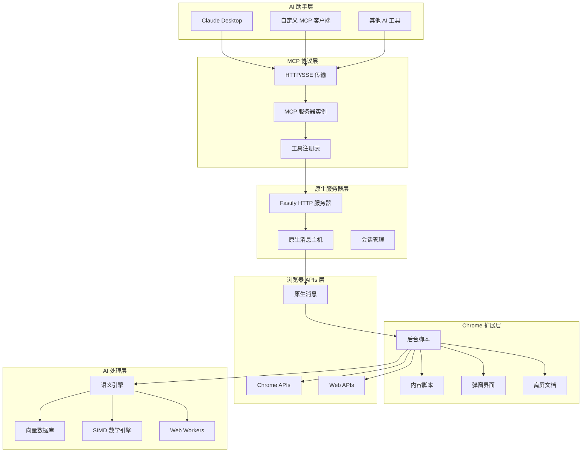

# Chrome MCP Server 架构设计 🏗️

本文档提供 Chrome MCP Server 架构、设计决策和实现细节的详细技术概述。

## 📋 目录

- [概述](#概述)
- [系统架构](#系统架构)
- [组件详情](#组件详情)
- [数据流](#数据流)
- [AI 集成](#ai-集成)
- [性能优化](#性能优化)
- [安全考虑](#安全考虑)

## 🎯 概述

Chrome MCP Server 是一个复杂的浏览器自动化平台，通过模型上下文协议 (MCP) 将 AI 助手与 Chrome 浏览器功能连接起来。架构设计目标：

- **高性能**：SIMD 优化的 AI 操作和高效的原生消息传递
- **可扩展性**：模块化工具系统，便于添加新功能
- **可靠性**：强大的错误处理和优雅降级
- **安全性**：沙盒执行和基于权限的访问控制

## 🏗️ 系统架构



## 🔧 组件详情

### 1. 原生服务器 (`app/native-server/`)

**目的**：MCP 协议实现和原生消息桥接

**核心组件**：

- **Fastify HTTP 服务器**：处理基于 HTTP/SSE 的 MCP 协议
- **原生消息主机**：与 Chrome 扩展通信
- **会话管理**：管理多个 MCP 客户端会话
- **工具注册表**：将工具调用路由到 Chrome 扩展

**技术栈**：

- TypeScript + Fastify
- MCP SDK (@modelcontextprotocol/sdk)
- 原生消息协议

### 2. Chrome 扩展 (`app/chrome-extension/`)

**目的**：浏览器自动化和 AI 驱动的内容分析

**核心组件**：

- **后台脚本**：主要协调器和工具执行器
- **内容脚本**：页面交互和内容提取
- **弹窗界面**：用户配置和状态显示
- **离屏文档**：在隔离环境中进行 AI 模型处理

**技术栈**：

- WXT 框架 + Vue 3
- Chrome 扩展 APIs
- WebAssembly + SIMD
- Transformers.js

### 3. 共享包 (`packages/`)

#### 3.1 共享类型 (`packages/shared/`)

- 工具模式和类型定义
- 通用接口和工具
- MCP 协议类型

#### 3.2 WASM SIMD (`packages/wasm-simd/`)

- 基于 Rust 的 SIMD 优化数学函数
- 使用 Emscripten 编译 WebAssembly
- 向量运算性能提升 4-8 倍

## 🔄 数据流

### 工具执行流程

```
┌─────────────┐    ┌──────────────┐    ┌─────────────────┐    ┌──────────────┐
│ AI 助手     │    │ 原生服务器   │    │ Chrome 扩展     │    │ 浏览器 APIs  │
└─────┬───────┘    └──────┬───────┘    └─────────┬───────┘    └──────┬───────┘
      │                   │                      │                   │
      │ 1. 工具调用       │                      │                   │
      ├──────────────────►│                      │                   │
      │                   │ 2. 原生消息          │                   │
      │                   ├─────────────────────►│                   │
      │                   │                      │ 3. 执行工具       │
      │                   │                      ├──────────────────►│
      │                   │                      │ 4. API 响应       │
      │                   │                      │◄──────────────────┤
      │                   │ 5. 工具结果          │                   │
      │                   │◄─────────────────────┤                   │
      │ 6. MCP 响应       │                      │                   │
      │◄──────────────────┤                      │                   │
```

### AI 处理流程

```
┌─────────────┐    ┌──────────────┐    ┌─────────────────┐    ┌──────────────┐
│ 内容提取    │    │ 文本分块器   │    │ 语义引擎        │    │ 向量数据库   │
└─────┬───────┘    └──────┬───────┘    └─────────┬───────┘    └──────┬───────┘
      │                   │                      │                   │
      │ 1. 原始内容       │                      │                   │
      ├──────────────────►│                      │                   │
      │                   │ 2. 文本块            │                   │
      │                   ├─────────────────────►│                   │
      │                   │                      │ 3. 嵌入向量       │
      │                   │                      ├──────────────────►│
      │                   │                      │                   │
      │                   │ 4. 搜索查询          │                   │
      │                   ├─────────────────────►│                   │
      │                   │                      │ 5. 查询向量       │
      │                   │                      ├──────────────────►│
      │                   │                      │ 6. 相似文档       │
      │                   │                      │◄──────────────────┤
      │                   │ 7. 搜索结果          │                   │
      │                   │◄─────────────────────┤                   │
```

## 🧠 AI 集成

### 语义相似度引擎

**架构**：

- **模型支持**：BGE-small-en-v1.5、E5-small-v2、Universal Sentence Encoder
- **执行环境**：Web Workers 用于非阻塞处理
- **优化**：向量运算的 SIMD 加速
- **缓存**：嵌入和分词的 LRU 缓存

**性能优化**：

```typescript
// SIMD 加速的余弦相似度
const similarity = await simdMath.cosineSimilarity(vecA, vecB);

// 批处理提高效率
const similarities = await simdMath.batchSimilarity(vectors, query, dimension);

// 内存高效的矩阵运算
const matrix = await simdMath.similarityMatrix(vectorsA, vectorsB, dimension);
```

### 向量数据库 (hnswlib-wasm)

**特性**：

- **算法**：分层导航小世界 (HNSW)
- **实现**：WebAssembly 实现接近原生性能
- **持久化**：IndexedDB 存储，自动清理
- **可扩展性**：高效处理 10,000+ 文档

**配置**：

```typescript
const config: VectorDatabaseConfig = {
  dimension: 384, // 模型嵌入维度
  maxElements: 10000, // 最大文档数
  efConstruction: 200, // 构建时精度
  M: 16, // 连接参数
  efSearch: 100, // 搜索时精度
  enableAutoCleanup: true, // 自动清理旧数据
  maxRetentionDays: 30, // 数据保留期
};
```

## ⚡ 性能优化

### 1. SIMD 加速

**Rust 实现**：

```rust
use wide::f32x4;

fn cosine_similarity_simd(&self, vec_a: &[f32], vec_b: &[f32]) -> f32 {
    let len = vec_a.len();
    let simd_lanes = 4;
    let simd_len = len - (len % simd_lanes);

    let mut dot_sum_simd = f32x4::ZERO;
    let mut norm_a_sum_simd = f32x4::ZERO;
    let mut norm_b_sum_simd = f32x4::ZERO;

    for i in (0..simd_len).step_by(simd_lanes) {
        let a_chunk = f32x4::new(vec_a[i..i+4].try_into().unwrap());
        let b_chunk = f32x4::new(vec_b[i..i+4].try_into().unwrap());

        dot_sum_simd = a_chunk.mul_add(b_chunk, dot_sum_simd);
        norm_a_sum_simd = a_chunk.mul_add(a_chunk, norm_a_sum_simd);
        norm_b_sum_simd = b_chunk.mul_add(b_chunk, norm_b_sum_simd);
    }

    // 计算最终相似度
    let dot_product = dot_sum_simd.reduce_add();
    let norm_a = norm_a_sum_simd.reduce_add().sqrt();
    let norm_b = norm_b_sum_simd.reduce_add().sqrt();

    dot_product / (norm_a * norm_b)
}
```

### 2. 内存管理

**策略**：

- **对象池**：重用 Float32Array 缓冲区
- **延迟加载**：按需加载 AI 模型
- **缓存管理**：嵌入的 LRU 淘汰
- **垃圾回收**：显式清理大对象

### 3. 并发处理

**Web Workers**：

- **AI 处理**：模型推理的独立 worker
- **内容索引**：后台标签页内容索引
- **网络捕获**：并行请求处理

## 🔧 扩展点

### 添加新工具

1. **定义模式** 在 `packages/shared/src/tools.ts`
2. **实现工具** 继承 `BaseBrowserToolExecutor`
3. **注册工具** 在工具索引中
4. **添加测试** 用于功能测试

### 自定义 AI 模型

1. **模型集成** 在 `SemanticSimilarityEngine`
2. **Worker 支持** 用于处理
3. **配置** 在模型预设中
4. **性能测试** 使用基准测试

### 协议扩展

1. **MCP 扩展** 用于自定义功能
2. **传输层** 用于不同通信方法
3. **身份验证** 用于安全连接
4. **监控** 用于性能指标

此架构使 Chrome MCP Server 能够在保持安全性和可扩展性的同时，提供高性能的浏览器自动化和先进的 AI 功能。
